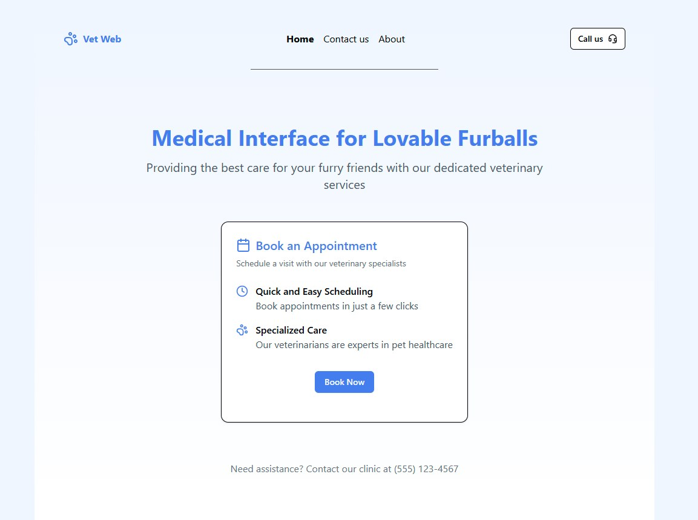

# Medical Interface for Lovable Furballs

[](https://github.com/Shuunen/vet-web/blob/master/LICENSE)

> Medical webapp for veterinarians


## Archived

This repo is archived since it migrated to [Shuunen/monorepo](https://github.com/Shuunen/monorepo/tree/master/apps/vet-web).

Further development will be done there 🚀

- [Medical Interface for Lovable Furballs](#medical-interface-for-lovable-furballs)
  - [Archived](#archived)
  - [Goal](#goal)
  - [Demo](#demo)
  - [Todo](#todo)
  - [Structure](#structure)
  - [Examples](#examples)
    - [Home page](#home-page)
    - [Root route](#root-route)
    - [Form contact](#form-contact)
  - [Thanks](#thanks)
  - [Page views](#page-views)

## Goal

The goal of this project is to provide veterinarians with a comprehensive web application to streamline the management of their practice. The platform will allow them to:

- **Manage patient records**: Store and update medical histories, treatments, and vaccination schedules.
- **Schedule and track appointments**: Set up consultations, send reminders, and prevent scheduling conflicts.
- **Facilitate communication**: Provide a secure messaging system for veterinarians to communicate with pet owners.
- **Generate reports and prescriptions**: Easily create and store medical documents.
- **Improve workflow efficiency**: Reduce paperwork and administrative overhead with an intuitive interface.

This webapp aims to enhance the daily operations of veterinary clinics, making patient care more efficient and organized.

## Demo



## Todo

- [ ] TanStack routing, branching in forms, xstate ?
- [ ] Test grpc-web
- [ ] Compare Zustand with other state management libraries
- [ ] Performance monitoring (lighthouse)

## Structure

src/
├── components/            # UI Components (Atomic Design)
│   ├── atoms/             # Smallest reusable components (Button, Input, Label)
│   ├── molecules/         # Grouped atoms forming functional components
│   ├── organisms/         # Complex UI structures combining molecules
│
├── utils/                 # Business logic and utilities
│   ├── foobar.const.ts    # Foobar related constants
│   ├── foobar.store.ts    # Foobar related Zustand store
│   ├── foobar.utils.ts    # Foobar related utility functions
│   ├── foobar.types.ts    # Foobar related TypeScript types
│
├── pages/                 # Page components (LoginPage, DashboardPage)
│        ├── App.tsx       # Main app entry point
│
├── routes/                # TanStack app routing
│   ├── __root.tsx.tsx     # Root route
│   ├── index.tsx          # Home page
│   ├── about.tsx          # About page
│
├── .gitignore
├── package.json
├── README.md              # This file :p

## Examples

### Home page

```tsx
// src/routes/index.tsx
import { Button } from '@/components/ui/button'
import { Card, CardContent, CardDescription, CardFooter, CardHeader, CardTitle } from '@/components/ui/card'
import { createFileRoute } from '@tanstack/react-router'
import { Calendar, Clock, PawPrint } from 'lucide-react'

function Index() {
  return (
    <div className="container mx-auto px-4 py-16">
      <div className="flex flex-col items-center justify-center mb-12">
        <h1 className="text-4xl font-bold text-center text-primary">Medical Interface for Lovable Furballs</h1>
        <p className="mt-4 text-xl text-gray-600 text-center max-w-2xl">Providing the best care for your furry friends with our dedicated veterinary services</p>
      </div>

      <div className="flex justify-center">
        <Card>
          <CardHeader>
            <CardTitle>
              <Calendar className="mr-2 h-6 w-6" />
              Book an Appointment
            </CardTitle>
            <CardDescription>Schedule a visit with our veterinary specialists</CardDescription>
          </CardHeader>
          <CardContent>
            <div className="space-y-4">
              <div className="flex items-start">
                <Clock className="h-5 w-5 text-primary mr-3 mt-0.5" />
                <div>
                  <h3 className="font-medium">Quick and Easy Scheduling</h3>
                  <p className="text-gray-600">Book appointments in just a few clicks</p>
                </div>
              </div>
              <div className="flex items-start">
                <PawPrint className="h-5 w-5 text-primary mr-3 mt-0.5" />
                <div>
                  <h3 className="font-medium">Specialized Care</h3>
                  <p className="text-gray-600">Our veterinarians are experts in pet healthcare</p>
                </div>
              </div>
            </div>
          </CardContent>
          <CardFooter className="flex justify-center pb-6 pt-2">
            <Button>Book Now</Button>
          </CardFooter>
        </Card>
      </div>

      <div className="mt-16 text-center text-gray-500">
        <p>Need assistance? Contact our clinic at (555) 123-4567</p>
      </div>
    </div>
  )
}

export const Route = createFileRoute('/')({
  component: Index,
})
```

### Root route

```tsx
// src/routes/__root.tsx
import { Toaster } from '@/components/ui/toaster'
import { Header } from '@/components/molecules/header'
import { Outlet, createRootRoute } from '@tanstack/react-router'
import { TanStackRouterDevtools } from '@tanstack/react-router-devtools'

export const Route = createRootRoute({
  component: () => (
    <div className="flex flex-col gap-4">
      <Header />
      <hr />
      <Outlet />
      <TanStackRouterDevtools />
      <Toaster />
    </div>
  ),
})
```

### Form contact

```tsx
// src/components/molecules/form-contact.tsx
import { Button } from '@/components/ui/button'
import { Form, FormControl, FormField, FormItem, FormLabel, FormMessage } from '@/components/ui/form'
import { Textarea } from '@/components/ui/textarea'
import { useFormStore } from '@/utils/contact.store'
import { msInSecond } from '@/utils/date.const'
import { zodResolver } from '@hookform/resolvers/zod'
import { debounce } from 'es-toolkit'
import { useForm } from 'react-hook-form'
import { toast } from 'sonner'
import { z } from 'zod'
import { FormUser } from './form-user'

// eslint-disable-next-line max-lines-per-function
export function FormContact() {
  const { firstName, lastName, message, setFormData, resetForm } = useFormStore()

  const form = useForm<ContactForm>({
    defaultValues: {
      message,
      user: {
        firstName,
        lastName,
      },
    },
    resolver: zodResolver(contactFormSchema),
  })

  function saveFormDataSync() {
    const values = form.getValues()
    setFormData({
      firstName: values.user.firstName,
      lastName: values.user.lastName,
      message: values.message,
    })
    toast.info('Form data saved')
  }

  const saveFormData = debounce(saveFormDataSync, msInSecond)

  function clearFormData() {
    resetForm()
    form.reset()
    toast.info('Form data cleared')
  }

  function onSubmit(values: ContactForm) {
    // eslint-disable-next-line no-console
    console.log(values)
    toast.success('Form submitted')
  }

  return (
    <Form {...form}>
      <form onSubmit={form.handleSubmit(onSubmit)} onChange={saveFormData} className="space-y-4">
        <FormField
          control={form.control}
          name="user.firstName"
          render={({ field }) => (
            <FormItem>
              <FormLabel>First name(s)</FormLabel>
              <FormControl>
                <Input {...field} data-testid={field.name} />
              </FormControl>
              <FormMessage />
            </FormItem>
          )}
        />
        <FormField
          control={form.control}
          name="user.lastName"
          render={({ field }) => (
            <FormItem>
              <FormLabel>Last name</FormLabel>
              <FormControl>
                <Input {...field} data-testid={field.name} />
              </FormControl>
              <FormMessage />
            </FormItem>
          )}
        />
        <FormField
          control={form.control}
          name="message"
          render={({ field }) => (
            <FormItem>
              <FormLabel>Message</FormLabel>
              <FormControl>
                <Textarea data-testid={field.name} placeholder="Type your message here." {...field} />
              </FormControl>
              <FormMessage />
            </FormItem>
          )}
        />
        <Button type="submit">Submit</Button>
      </form>
    </Form>
  )
}
```

## Thanks

- [Biome](https://biomejs.dev) : super fast linter & formatter
- [Boxy Svg](https://boxy-svg.com) : simple & effective svg editor
- [Esbuild](https://github.com/evanw/esbuild) : an extremely fast JavaScript bundler and minifier
- [Favicon](https://realfavicongenerator.net/) : the favicon generator
- [Github](https://github.com) : for all their great work year after year, pushing OSS forward
- [Knip](https://knip.dev/) : the code quality tool
- [Lucid icons](https://lucide.dev/icons/) : the icons
- [Oxc](https://oxc.rs) : a lovely super-fast collection of JavaScript tools written in Rust
- [React-app-structure](https://github.com/Shpendrr/react-app-structure) : the structure template
- [React](https://react.dev) : great library for web and native user interfaces
- [Repo-checker](https://github.com/Shuunen/repo-checker) : eslint cover /src code and this tool the rest ^^
- [Shadcn/ui](https://ui.shadcn.com/) : the UI components
- [Shields.io](https://shields.io) : for the nice badges on top of this readme
- [Shuutils](https://github.com/Shuunen/shuutils) : collection of pure JS utils
- [Svg Omg](https://jakearchibald.github.io/svgomg/) : the great king of svg file size reduction
- [TailwindCss](https://tailwindcss.com) : awesome lib to produce maintainable style
- [V8](https://github.com/demurgos/v8-coverage) : simple & effective cli for code coverage
- [Vite](https://vitejs.dev/) : the bundler
- [Vitest](https://github.com/vitest-dev/vitest) : super fast vite-native testing framework
- [Zod](https://github.com/colinhacks/zod) : typeScript-first schema validation

## Page views

[](https://github.com/Kumara2mahe/Views-Counter)
