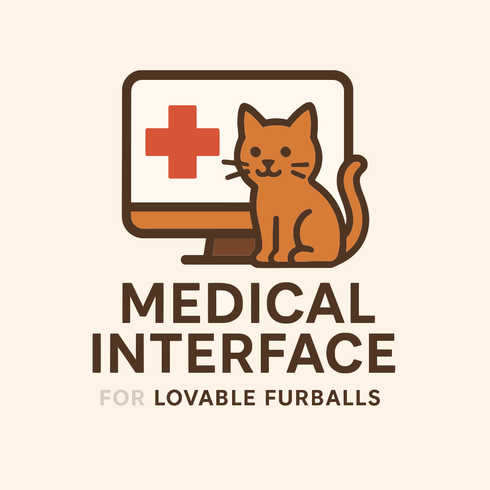

# Medical Interface for Lovable Furballs

> Medical webapp for veterinarians



## Goal

The goal of this project is to provide veterinarians with a comprehensive web application to streamline the management of their practice. The platform will allow them to:

- **Manage patient records**: Store and update medical histories, treatments, and vaccination schedules.
- **Schedule and track appointments**: Set up consultations, send reminders, and prevent scheduling conflicts.
- **Facilitate communication**: Provide a secure messaging system for veterinarians to communicate with pet owners.
- **Generate reports and prescriptions**: Easily create and store medical documents.
- **Improve workflow efficiency**: Reduce paperwork and administrative overhead with an intuitive interface.

This webapp aims to enhance the daily operations of veterinary clinics, making patient care more efficient and organized.

## Todo

- [ ] TanStack routing, branching in forms, xstate ?
- [ ] Test grpc-web
- [ ] Compare Zustand with other state management libraries
- [ ] Performance monitoring (lighthouse)

## Template

This React + TypeScript + Vite template provides a minimal setup to get React working in Vite with HMR and some ESLint rules.

Currently, two official plugins are available:

- [@vitejs/plugin-react](https://github.com/vitejs/vite-plugin-react/blob/main/packages/plugin-react/README.md) uses [Babel](https://babeljs.io/) for Fast Refresh
- [@vitejs/plugin-react-swc](https://github.com/vitejs/vite-plugin-react-swc) uses [SWC](https://swc.rs/) for Fast Refresh

## Expanding the ESLint configuration

If you are developing a production application, we recommend updating the configuration to enable type-aware lint rules:

```js
export default tseslint.config({
  extends: [
    // Remove ...tseslint.configs.recommended and replace with this
    ...tseslint.configs.recommendedTypeChecked,
    // Alternatively, use this for stricter rules
    ...tseslint.configs.strictTypeChecked,
    // Optionally, add this for stylistic rules
    ...tseslint.configs.stylisticTypeChecked,
  ],
  languageOptions: {
    // other options...
    parserOptions: {
      project: ['./tsconfig.node.json', './tsconfig.app.json'],
      tsconfigRootDir: import.meta.dirname,
    },
  },
})
```

You can also install [eslint-plugin-react-x](https://github.com/Rel1cx/eslint-react/tree/main/packages/plugins/eslint-plugin-react-x) and [eslint-plugin-react-dom](https://github.com/Rel1cx/eslint-react/tree/main/packages/plugins/eslint-plugin-react-dom) for React-specific lint rules:

```js
// eslint.config.js
import reactX from 'eslint-plugin-react-x'
import reactDom from 'eslint-plugin-react-dom'

export default tseslint.config({
  plugins: {
    // Add the react-x and react-dom plugins
    'react-x': reactX,
    'react-dom': reactDom,
  },
  rules: {
    // other rules...
    // Enable its recommended typescript rules
    ...reactX.configs['recommended-typescript'].rules,
    ...reactDom.configs.recommended.rules,
  },
})
```

## Thanks

- [knip](https://knip.dev/) : the code quality tool
- [lucid icons](https://lucide.dev/icons/) : the icons
- [react-app-structure](https://github.com/Shpendrr/react-app-structure) : the structure template
- [shadcn/ui](https://ui.shadcn.com/) : the UI components
- [vite](https://vitejs.dev/) : the bundler
